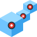
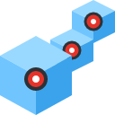

<p align="center">
  
</p>

<h1 align="center">Sketch Point Pattern for Autodesk Fusion 360</h1>

<p align="center">
  <b>High-performance, reactive, arbitrary sketch-point driven patterning engine for Autodesk Fusion 360.</b>
</p>

<p align="center">
  
  
  
  
</p>

---

## Overview

Autodesk Fusion 360 natively supports Rectangular and Circular patterns, but lacks a built-in tool for patterning solid bodies across **arbitrary 2D or 3D sketch points**. 

**Sketch Point Pattern** bridges this gap by introducing a custom feature engine that replicates any solid body across all points in a target sketch with blazing-fast compute times, full timeline integration, and reactive automatic updates.

---

## Key Features

- **Arbitrary Point Distribution:** Pattern solid bodies across any arrangement of sketch points, construction points, or vertices.
- **Blazing Fast (<50ms for 100+ instances):** Uses `TemporaryBRepManager` to perform transformations directly in memory, eliminating timeline bloat and UI freezes.
- **Reactive Parametric Updates:** Automatically detects modifications to target sketch point positions or source body dimensions via an MD5 geometric state hash and recomputes out-of-date geometry.
- **Self-Healing Topology Architecture:** Implements name fallbacks and coordinate decoupling so that patterns do not break when Fusion rebuilds entity tokens during upstream edits.
- **Seamless Timeline Editing:** Double-clicking or editing the pattern node in the timeline automatically re-opens the custom command dialog with existing selections pre-populated.
- **Optional Boolean Union:** Combine all generated instances into a single unified body or keep them as distinct solid bodies.

---

## Installation

### 1. Locate your Fusion 360 `AddIns` Directory

Clone or copy the `SketchPointPattern` folder into your local Fusion 360 Add-Ins directory:

* **macOS:**
  ```bash
  ~/Library/Application Support/Autodesk/Autodesk Fusion 360/API/AddIns/
  ```
* **Windows:**
  ```text
  %appdata%\Autodesk\Autodesk Fusion 360\API\AddIns\
  ```

#### Quick Install via Terminal (macOS):
```bash
cd ~/Library/Application\ Support/Autodesk/Autodesk\ Fusion\ 360/API/AddIns/
git clone https://github.com/your-username/SketchPointPattern.git
```

---

### 2. Enable in Fusion 360

1. Open **Autodesk Fusion 360**.
2. Navigate to the **Utilities** tab on the top ribbon.
3. Click **Scripts and Add-Ins** (or press <kbd>Shift</kbd> + <kbd>S</kbd>).
4. Switch to the **Add-Ins** tab at the top of the dialog.
5. Select **Sketch Point Pattern** from the list.
6. Check **Run on Startup** if you want it loaded automatically whenever Fusion starts.
7. Click **Run**.

<p align="center">
  <br/>
  <i>The "Sketch Point Pattern" button will appear under <b>Design &gt; Solid &gt; Create</b> panel.</i>
</p>

---

## How to Use

### Step-by-Step Workflow

1. **Prepare Your Geometry:**
   - Create the **Source Body** you want to replicate.
   - Create a **Target Sketch** containing the sketch points where you want instances placed.
   - Identify or create an **Anchor Point** on/near the source body (can be a sketch point, vertex, or construction point) to serve as the reference origin.

2. **Launch the Command:**
   - In the **Solid** workspace, open the **Create** dropdown and click **Sketch Point Pattern**.

3. **Configure the Dialog:**
   - **Source Body:** Select the solid body to pattern.
   - **Anchor Point:** Select the point representing the origin of the source body.
   - **Target Sketch:** Select the sketch containing target points.
   - **Combine Instances into 1 Body:** Check to automatically Boolean Union all instances into a single body.
   - **Keep Source Body Visible:** Toggle whether the original source body stays visible.

4. **Click OK:**
   - The add-in generates all instances inside a single, clean timeline feature named `Sketch Pattern (N pts)`.

---

### Editing & Updating

- **Modifying the Pattern:** Double-click the `Sketch Pattern` feature in the timeline, or select it and click the **Sketch Point Pattern** toolbar icon. The dialog will open with your previous settings pre-loaded.
- **Parametric Updates:** Edit your target sketch or modify upstream source geometry. When you finish editing, the add-in automatically detects the change and re-evaluates the pattern instances.

---

## Technical Highlights

| Architecture Component | Implementation Strategy |
| :--- | :--- |
| **Geometry Computation** | Uses `adsk.fusion.TemporaryBRepManager` in RAM to avoid creating dozens of discrete timeline operations. |
| **Reactive Evaluation** | Hooks into `ui.commandTerminated` with high-frequency command filtering (ignoring pan/zoom/orbit). |
| **State Tracking** | Computes an MD5 checksum combining sketch coordinate tuples, source volume, and bounding box limits. |
| **Self-Healing Fallbacks** | Serializes both entity tokens and entity names to survive upstream token destruction. |

---

## Project Structure

```text
SketchPointPattern/
├── SketchPointPattern.manifest   # Fusion 360 Add-In metadata
├── SketchPointPattern.py         # Complete add-in engine & event handlers
├── icon.svg                      # Vector master icon
├── convert_svg_to_icons.py       # Icon rasterization build script
├── resources/                    # Multi-resolution PNGs for Fusion UI
│   ├── 16x16.png / @2x / -dark
│   ├── 32x32.png / @2x / -dark
│   └── 64x64.png / @2x / -dark
└── README.md
```

---

## Author & License

- **Author:** Leo Becker
- **License:** MIT License
